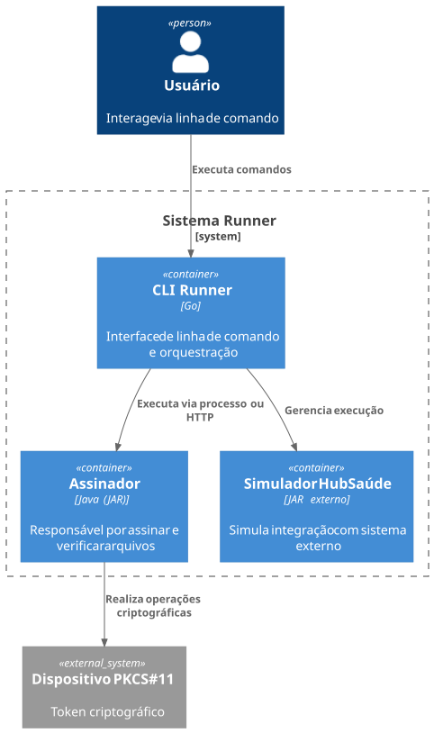
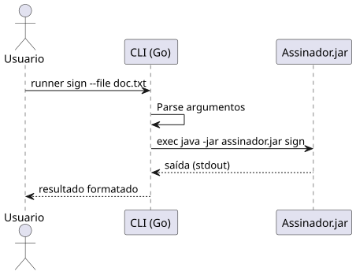
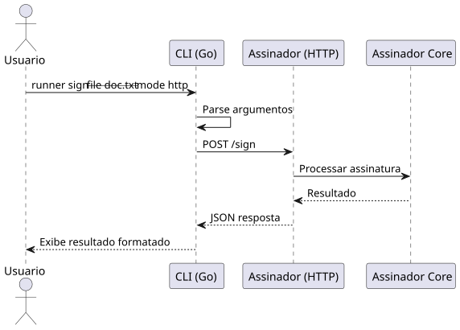

# RUNNER

Repositório destinado ao desenvolvimento do trabalho prático da disciplina de **Implementação e Integração de Software**.

> Os requisitos gerais, especificações da disciplina e artefatos oficiais do projeto estão disponíveis no repositório do professor:
> [Runner — Repositório Oficial](https://github.com/kyriosdata/runner)

---

## Visão Geral

O **Runner** é uma solução responsável por simplificar a execução de aplicações Java utilizadas no ecossistema HubSaúde, abstraindo detalhes de configuração, execução e gerenciamento do ambiente.

A aplicação foi projetada para operar tanto via **linha de comando** quanto via **HTTP**, permitindo integração simples com diferentes fluxos de uso.

### Principais responsabilidades

* execução do `assinador.jar`;
* disponibilização de modo HTTP persistente;
* gerenciamento do Simulador HubSaúde;
* provisionamento automático do JDK;
* distribuição multiplataforma.

---

## Arquitetura

A solução utiliza uma arquitetura em camadas com características do padrão **Microkernel**, priorizando:

* modularidade;
* baixo acoplamento;
* extensibilidade;
* portabilidade;
* facilidade de manutenção.

Os componentes foram organizados seguindo princípios **SOLID**, permitindo evolução incremental e separação clara de responsabilidades.

---

### Visão arquitetural



---

### Fluxos de execução

#### Execução local via CLI

O CLI invoca diretamente o `assinador.jar` utilizando `java -jar`, realizando o fluxo completo de inicialização da JVM.



---

#### Execução via HTTP

O assinador permanece em execução como servidor HTTP, reduzindo overhead de inicialização e melhorando desempenho em múltiplas requisições.



---

## Tecnologias Utilizadas

| Camada / Módulo     | Linguagem | Tecnologias                            |
| ------------------- | --------- | -------------------------------------- |
| Assinador           | Java      | JDK 21, Maven, Picocli, Jackson, JUnit |
| Servidor HTTP       | Java      | HTTP Server nativo                     |
| CLI                 | Go        | Cobra, net/http                        |
| Provisionamento JDK | Go        | archive/zip, os, net/http              |
| Qualidade e CI/CD   | Multi     | GitHub Actions, Cosign, Go Test, JUnit |

---

## Estrutura do Projeto

```bash
.
├── diagramas/
├── documentacao/
├── gerenciamento/
├── simulador/
└── README.md
```

---

## Organização do Repositório

### `diagramas/`

Diagramas arquiteturais e fluxos de execução do sistema.

* Modelo C4
* Diagramas de sequência
* Fluxos CLI e HTTP

---

### `documentacao/`

Documentação técnica relacionada exclusivamente à implementação dos módulos deste repositório.

* [assinador](./documentacao/assinador) 
* [servidor](./documentacao/servidor) 
* [CLI](./documentacao/cli)

> Demais documentações encontram-se no repositório oficial da disciplina.

---

### `gerenciamento/`

Artefatos de acompanhamento e planejamento do projeto.

* [Backlog](./gerenciamento/backlog.md)
* [Cronograma](./gerenciamento/cronograma-execucao.md)
* [Matriz de Rastreabilidade](./gerenciamento/matriz-rastreabilidade.md)

---

## Épicos do Projeto

| Épico                       | Descrição                                    |[x]|
| --------------------------- | -------------------------------------------- |---|
| Assinador (`assinador.jar`) | Simulação de assinatura e validação digital  |[x]|
| Servidor HTTP do Assinador  | Execução persistente via HTTP                |[x]|
| CLI Assinatura              | Interface multiplataforma em Go              |[x]|
| Simulador HubSaúde          | Gerenciamento do simulador externo           |[ ]|
| Provisionamento do JDK      | Download e configuração automática do Java   |[ ]|
| Qualidade e Entrega         | Testes, CI/CD e distribuição multiplataforma |[ ]|

---

## Qualidade e Entrega

O projeto adota práticas voltadas à confiabilidade e padronização da entrega:

* testes automatizados;
* integração contínua;
* versionamento semântico;
* geração automatizada de releases;
* distribuição multiplataforma;
* assinatura de artefatos com Cosign.

---

## Referências

* [Runner — Repositório Oficial](https://github.com/kyriosdata/runner)
* [Cobra CLI](https://cobra.dev)
* [Picocli](https://picocli.info)
* [Cosign](https://docs.sigstore.dev)
